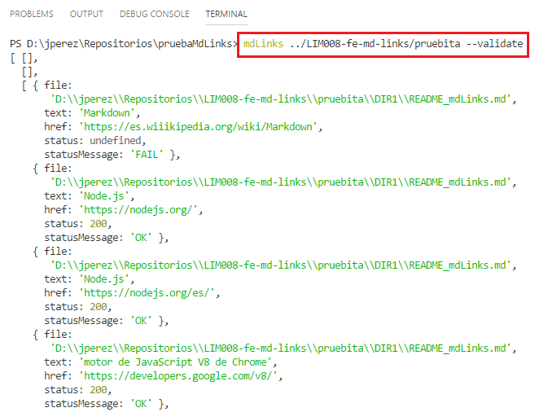

# Markdown Links

## Introduccion

[Markdown](https://es.wikipedia.org/wiki/Markdown) es un lenguaje de marcado
ligero muy popular entre developers. Es usado en muchísimas plataformas que
manejan texto plano (GitHub, foros, blogs, ...), y es muy común
encontrar varios archivos en ese formato en cualquier tipo de repositorio
(empezando por el tradicional `README.md`).

Estos archivos `Markdown` normalmente contienen _links_ (vínculos/ligas) que
muchas veces están rotos o ya no son válidos y eso perjudica mucho el valor de
la información que se quiere compartir.

## Objetivo

Se creo una librería para obtener información especifica de links(urls) en archivos Markdown utilizando [Node.js](https://nodejs.org/es/)

## Instalación

Para instalar la librería solo deberás de crear una carpeta en el cual harás tus pruebas, abrir tu terminal desde la ruta de creación y escribirás el siguiente comando: npm i JackelinPerez/md-links , como indica en la siguiente figura:

## Sintaxis

### Parametros de entrada

- `path`: Ruta absoluta o relativa al archivo o directorio. Si la ruta pasada es
  relativa, debe resolverse como relativa al directorio desde donde se invoca
  node - _current working directory_).
- `options`: Un objeto con las siguientes propiedades:
  * `validate`: Booleano que determina si se desea validar los links
    encontrados.

#### Valor de retorno

La función debe retornar una promesa (`Promise`) que resuelva a un arreglo
(`Array`) de objetos (`Object`), donde cada objeto representa un link y contiene
las siguientes propiedades:

- `href`: URL encontrada.
- `text`: Texto que aparecía dentro del link (`<a>`).
- `file`: Ruta del archivo donde se encontró el link.

## Modo de Uso

### Linea de Comandos

Habrá 4 posibles combinaciones de uso:

 #### Primera Opcion:
 Invocando la librería y el directorio a buscar, este puede ser relativo o absoluto, así como muestra la siguiente imagen:

 #### Segunda Opcion:
 Invocando la librería el directorio a buscar, este puede ser relativo o absoluto, y la opcion --validate, así como muestra la siguiente imagen:

 #### Tercera Opcion:
 Invocando la librería el directorio a buscar, este puede ser relativo o absoluto, y la opcion --stats, así como muestra la siguiente imagen:

 #### Cuarta Opcion:
 Invocando la librería el directorio a buscar, este puede ser relativo o absoluto, y la opcion --stats y --validate, así como muestra la siguiente imagen:

### Importando a otros scripts

Importando la libreria a otro script.

#### Primera Opcion:

Con validate: true, como muestra la siguiente imagen:

#### Segunda Opcion:

Con validate: false, como muestra la siguiente imagen:

## Conclusion.

Con esta libreria los usuarios podran conocer el status de sus links asi como algunos datos estadisticos en sus archivos Markdown.